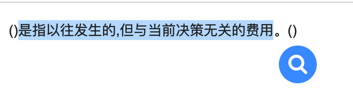
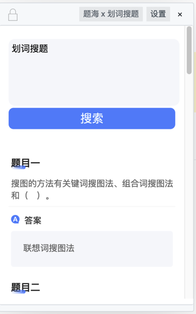
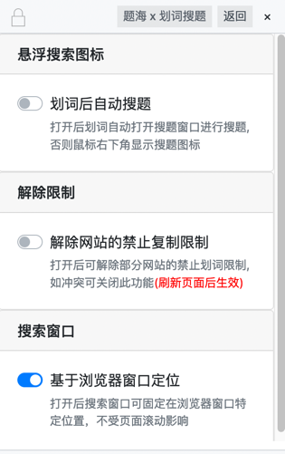

# 使用

::: warning 前提条件
您已正确安装 划词搜题 脚本
:::

## 默认配置
**快速上手**

- 如果您作为普通用户，那么您也无需去自定义设置，因为目前默认设置就是最好用的，您划词之后如图所示，就会出现搜题的图标，(如果是首次使用，会邀请您```关注微信公众号```，您需扫码关注微信公众号)点击搜题的图标，即可完成搜题



- 如果您对划词的内容不满意，您也可以在此输入框内输入您的问题，然后点击下方搜索按钮重新搜索



## 个性化设置
上图右上角有 **设置** 按钮，点击即可打开自定义设置



**是否自动搜题**

如果您打开了 ```划词自动搜题``` 开关，那么划词后直接搜题，不再显示搜索图标更快人一步，缺点在于，可能误触导致搜索，如果频繁误触，可以关闭油猴插件。

**解除限制**

有些网站无法划词或者无法复制，您打开  ```解除网站的禁止复制限制``` 即可解除禁止划词或者复制限制，需要刷新页面后生效

**搜索窗口**

默认搜索窗口不随页面滚动而滚动，固定于浏览器窗口，如果您想要搜索窗口随着页面滚动，那么您需要关闭 ```基于浏览器窗口定位```开关

**寻找最外层iframe**

如果开启此功能，脚本将寻找最外层iframe，支持全窗口拖动，有未知BUG，如果遇到不显示窗口的情况可以将本选项关闭，划词窗口只能在当前iframe中拖动
